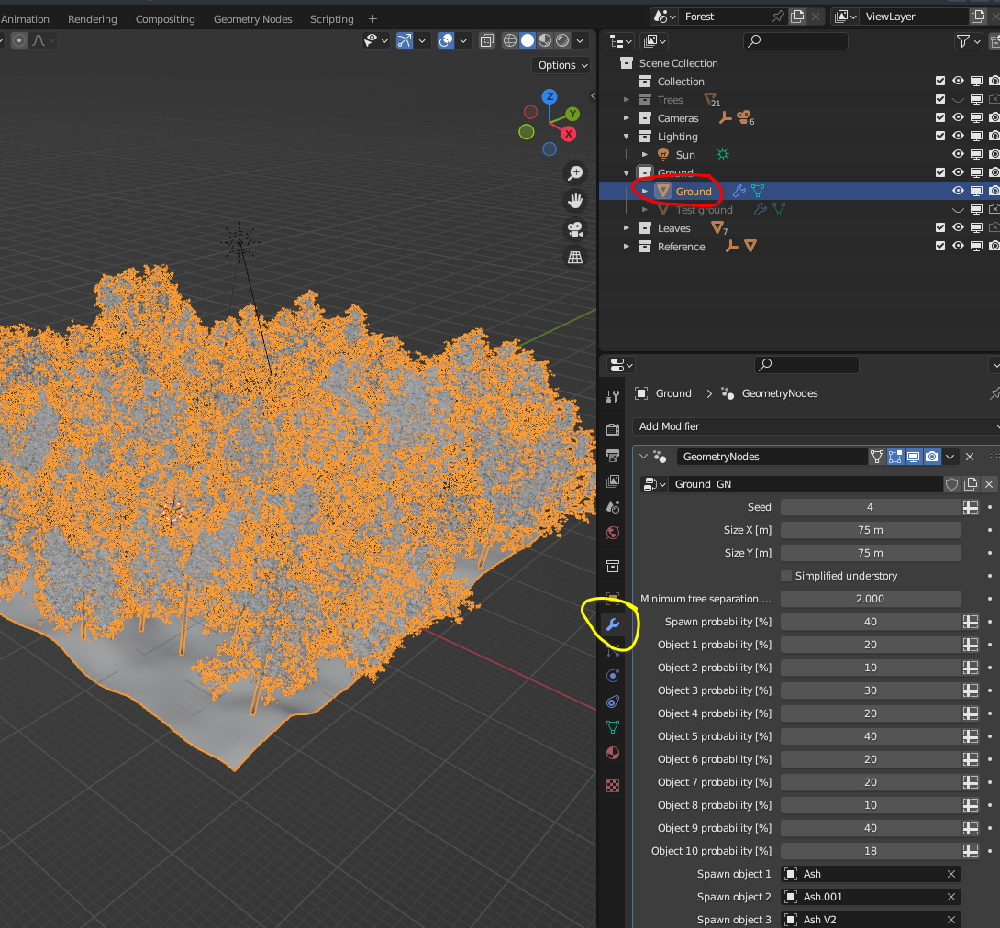
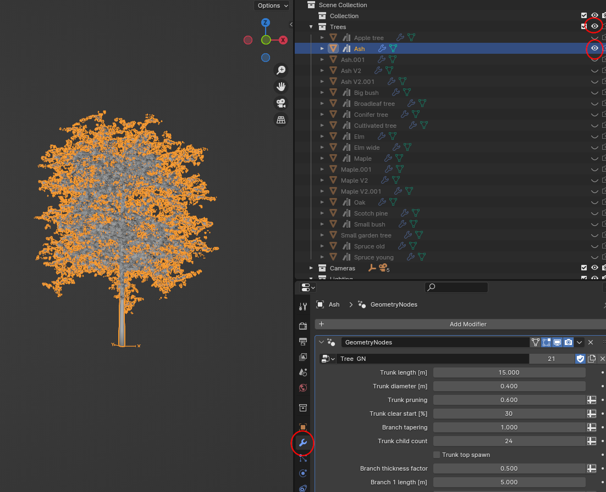

.. _chap-system-simulation:

The System Simulation
==============================

The system simulation is quite a bit more complicated than the slab simulation
in previous tutorial. However, the main idea of the system simulation is quite
simple: we take the virtual 3D slabs and put them into some bigger context
to create spectral simulations of some meaningful environment. We will
use a forest canopy as an example in this tutorial as it is the main focus
of HyperBlend, but other simulation scenarios are possible too. As an example
the already mentioned photobioreactor simulation conducted in
paper :cite:`riihiaho25`.

In the canopy simulation, we have quite a few moving parts. Firstly, the geometry,
i.e., the three dimensional shape of all of the objects has to be defined. This
includes the terrain, the trees, bushes, and so on. From spectral point of view,
we already have defined the spectral reflectance and transmittance properties for
the leaf slabs, but not for anything else. So, we will need shaders for tree trunks,
and soil. Also the illumination of the scene needs to be defined. Then there is
camera parameters like field of view (FOV), location, and orientation.

These tasks are divided between Python coding and object manipulation in Blender.
A basic understanding of at least how to navigate Blender's view and change some
simple parameters is highly recommended for the user. These skills can be acquired
by following any of the simple "donut tutorials" found on video sharing platforms
across the internet. Some differences between the navigation and view in various
Blender versions exist, so it is perhaps easiest to search for tutorials on
Blender 3.6, which is the only version supported by HyperBlend.

In the slab simulation, Blender is used under the hood of HyperBlend, and we
didn't really have to open the Blender UI at all. The system simulation is
different in that regard. The connection between HyperBlend code and Blender
is implemented through Blender's Python API. In HyperBlend, all code that calls
Blender is secluded to :py:mod:`blender_scripts` module.

If you have not read through :ref:`sec-tiny-working-example` from the
:ref:`chap-basics`, do it now. It will teach you how to create a new
forest scene with mostly default settings, so you can get up to speed immediately.
You will run a full simulation, which will result in a spectral image cube of
a forest canopy.
The tutorial at hand will dig deeper into the intricacies of the process.

Initializing System Simulation
------------------------------------------

In the beginner tutorial, we already had the following code that initializes
our new forest scene. We assume that there is an existing slab simulation done
with the name "tutorial_slab_simulation" (instructions in the beginner tutorial).
We will create a new system simulation with name "tutorial_system_simulation_2".

.. code-block:: python3
    :linenos:

    if __name__ == "__main__":

        runtime = initialization.initialize()
        slab_sim_name = "tutorial_slab_simulation"
        system_sim_name = "tutorial_system_simulation_2"
        slab_material_names = ["Slab material 1", "Slab material 2", "Slab material 3"]

        # Pack leaf data for system_simulation scene initialization.
        leaves = [
            (slab_sim_name, 0, slab_material_names[0]),
            (slab_sim_name, 1, slab_material_names[1]),
            (slab_sim_name, 2, slab_material_names[2]),
        ]

        F.init(
            leaves=leaves,
            conf_type="m2m",
            new_system_sim_name=system_sim_name,
            soil_name="median_humid_clay",
            sun_file_name="default_sun",
            sky_file_name="default_sky",
        )

Until now, it's pretty much the same as in the beginner tutorial. We are still
creating a master to master (``conf_type="m2m"``) configuration file and use the
same precalculated soil spectra as before. The new thing is that we explicitly
define the sun and the sky spectra. The names of these spectra are the default
ones, so there is no change in behaviour compared to the beginner tutorial,
but if you have other spectra available, this is how you pass them. The
sun and sky spectra files live in `root/Light spectra/`. They are simple
text files with csv formatting, so you can use any light spectra you have
at hand.

See instructions on how to generate new light spectra with supported
third party simulators from :py:mod:`system_simulation.lighting`.

Shape your ground
------------------------------------------

Shaping your geometry is easiest to do inside Blender's UI. Running the previous
code snippet will create a new system simulation and you can open the associated
Blender scene by double clicking
`root/System simulation/scene_tutorial_system_simulation_2/tutorial_system_simulation_2.blend`.

The UI should look something like this

Select the object called Ground from the top right corner and then select
the wrench icon from bottom right corner as shown.

The full list of the 39 tunable parameters is:

    - Seed

        - Random seed value

    - Size X [m]

        - Width of the forest in meters

    - Size Y [m]

        - Width of the forest in meters

    - Simplified understory

        - Replace understory objects with their convex hull for faster response time while editing

    - Minimum tree separation [m]

        - Minimum separation of objects spawn by the primary spawning mechanism

    - Spawn probability [%]

        - General spawn probability, i.e. what percentage of points of the spawn grid can be used

    - Object 1-10 probability [%] (10 separate parameters)

        - These are similar to previous, but for each spawnable object separately

    - Spawn object 1-10 (10 separate parameters)

        - The actual objects to be spawn by the tree spawning system

    - Reference object

        - Reference plate object for reflectance calculation

    - Reference controller

        - An empty object that controls the x,y position of the Reference object

    - Reference height [m]

        - Reference object's height from local ground surface

    - Reference safe distance [m]

        - Spawn objects that are closer than this to the reference object will be un-spawn

    - Height map strength

        - How strongly will the height map move the vertices of the ground on z-axis

    - Height point separation [m]

        - How detailed grid is used to apply the height map (smaller value = more detail)

    - Max tree tilt [Deg]

        - Maximum random tilt that can be assigned to spawn objects

    - Max tree scale [%]

        - Maximum random scale that can be assigned to spawn objects

    - Understory object 1-2 (2 separate parameters)

        - Objects spawned using the secondary spawning mechanism

    - Understory 1-2 min separation [m] (2 separate parameters)

        - Minimum distance between the objects spawned by the secondary spawning mechanism

    - Ground material

        - Blender material used for the soil

The list may seem daunting, but most of them are pretty simple to understand.
The main ones affecting the shape of the ground are of course the size, and
the ones related to the height map. (Using a custom image for the height
map involves a bit of tinkering inside the geometry nodes structure, so you
need to know something about Blender.)

If you want your forest to look like planted by human in neat rows, put the
minimum tree separation high, and the overall spawn probability to 100 %. If
you want to use only one model like this (every tree is the same), put the
same tree object to each ``Spawn object X``. You can create holes in your rows
by setting some of the  ``Object X probability [%]`` to less than 100.

You can call this listing (without the explanations) from
:py:func:`blender_scripts.forest_utils.list_forest_parameters`. Since the
Sphinx autodoc breaks for this file, the above link does not work and you
need to check the comments from the actual source code file.

Shape your trees
------------------------------------------

The trees are also parametric models. To adjust them to your liking,
you should first hide the ground object, so that you can see what you
are doing. This can be done by clicking the eye icon on the top right
corner from the row with the `Ground` object (can be seen in the previous
picture).

The picture below shows how to unhide the `Trees` object collection
and any of the trees you want to reshape by clicking the eye icons.

Then you can adjust the parameters to your liking as before under
the wrench icon.
Below are the 28 adjustable parameters for the tree model
(obvious explanations omitted)

    - Branch thickness factor (VALUE)
    - Trunk length [m] (VALUE)
    - Trunk diameter [m] (VALUE)
    - Trunk pruning (VALUE)

        - Removes some of the branch spawning points to make airier crown

    - Trunk clear start [%] (INT)

        - Percentage of the trunk length that is left completely branchless

    - Trunk child count (INT)

        - How many first-level branches will be spawn on the trunk

    - Trunk top spawn (BOOLEAN)

        - If True, spawn one branch as a continuation of the trunk

    - Branch 1 length [m] (VALUE)
    - Branch 1 diameter [m] (VALUE)

    - Branch 1 scale (VALUE)

        - Scale 1st level branches bigger or smaller when approaching the top of the trunk

    - Branch 1 child count (INT)

        - How many 2nd level branches are spawn to the 1st level branch

    - Branch 1 align (VALUE)

        - Alignment of the 1st level branches to the tree trunk

    - Droop angle [deg] (VALUE)

        - How curved the branches will be

    - Branch 2 length [m] (VALUE)
    - Branch 2 child count (INT)
    - Branch 2 align (VALUE)
    - Branch 3 length [m] (VALUE)
    - Branch 3 align (VALUE)

    - Branch 3 resolution (INT)

        - How many faces will the last level branch have. This affects to how many leaves are spawn

    - Trunk material (MATERIAL)
    - Leaf material (MATERIAL)
    - Hide leafs (BOOLEAN)

    - Leaf object (OBJECT)

        - Select a leaf object to be used

    - Leaf density (VALUE)

        - More or less leaves

    - Average leaf angle (VALUE)

    - Seed (INT)

        - Random seed for this tree

    - Splines only (BOOLEAN)

        - Remove actual geometry and show only splines constructing the tree. For debugging

    - Hide trunk data (BOOLEAN)

        Trees can show some data of themselves. Must be hidden during rendering

Lighting
----------

The lighting of the scene is completely based on an third party simulator that is
used to generate the direct sunlight and scattered skylight spectra. By default,
there are two light spectra available in `root/Light spectra` called `default_sky.txt`
and `default_sun.txt`. The content of the default sun file begins like this

.. code-block::

    # Output file from SSolar_GOA model
    #   Input Data
    #  Ext. Spectrum= Wehrli
    # lat=41.66 lon=-4.7 sza=29.358 jday=152
    #  p=1013.0 o3=300.0 h2o=1.5 alb=0.2
    #  alpha=1.5 beta=0.05 Wa=0.98 g=0.75
    # Wavelength Irradiance
    400.0 0.77937
    401.0 0.84119
    402.0 0.87123
    403.0 0.87947
    404.0 0.87883
    ...

It is a simple CSV-formatted file with wavelengths and irradiances. Rows
prefixed with `#` are not read and can be used for comments and metadata.
The light files are directly read during the forest setup, where you can
also provide the name of the file(s) to be used.

Camera
----------

For top of canopy imaging setup, it is easiest to control the camera using
the control file. However, you may want to test for a good combination
of altitude and FOV for your forest scene (depending on scene dimensions)
through Blender UI.

The control file
-----------------------------

**The control file** is used to store values that define the geometry
of the scene. In other words it has the same values that were listed
above and many more. An extract of a control file is shown below

.. code-block::

    Note = "This file controls the setup of the Blender scene file. "
    is_master_control = true

    [Sun]
    Note = "When sun azimuth angle is 0 degrees, the sun points to positive y-axis direction in Blender that is thought as north in HyperBlend. 90 degrees would be pointing west, 180 to south and 270 to east, respectively. Zenith angle is the Sun's angle from zenith."
    sun_angle_zenith_deg = 23.550000484583723
    sun_angle_azimuth_deg = 335.91998685373596
    sun_base_power_hsi = 40
    sun_base_power_rgb = 400

    [Drone]
    Note = "Unit of drone location and altitude is meter."
    drone_location_x = 0.0
    drone_location_y = 0.0
    drone_altitude = 100.0

    [Cameras]
    Note = "Camera angles are stored in degrees in this file. They must be converted to radians before passing to Blender file."
    drone_hsi_fow = 28.000001917535847
    drone_rgb_fow = 28.000001917535847

    [Rendering]
    Note = "Sample count controls how many samples (light rays) are cast through each pixel.More samples result in smoother image but require more time to render. Try values between 16 and 512, for example. The RGB sampling is for preview images so it can be higher as not many images are rendered with that sampling."
    sample_count_rbg = 32
    sample_count_hsi = 32

    [Images]
    hsi_resolution_x = 1024
    hsi_resolution_y = 1024
    rgb_resolution_x = 1024
    rgb_resolution_y = 1024
    walker_resolution_x = 1024
    walker_resolution_y = 512
    sleeper_resolution_x = 1024
    sleeper_resolution_y = 512
    tree_preview_resolution_x = 1024
    tree_preview_resolution_y = 512

    [Forest.Seed]
    Value = 4
    Type = "INT"
    ID = 7

    [Forest."Size X [m]"]
    Value = 75.0
    "Standard deviation" = 7.5
    Type = "VALUE"
    ID = 8

    [Forest."Size Y [m]"]
    Value = 75.0
    "Standard deviation" = 7.5
    Type = "VALUE"
    ID = 9

    ...
    # Here are more terrain object parameters
    # These comment is not part of the file format
    # Then there are all the tree parameters
    ...

    [Forest."Spawn object 1"."Trunk length [m]"]
    Value = 15.0
    "Standard deviation" = 1.5
    Type = "VALUE"
    ID = 10

    [Forest."Spawn object 1"."Trunk diameter [m]"]
    Value = 0.4000000059604645
    "Standard deviation" = 0.04000000059604645
    Type = "VALUE"
    ID = 11

    [Forest."Spawn object 1"."Trunk pruning"]
    Value = 0.5999999046325684
    "Standard deviation" = 0.05999999046325684
    Type = "VALUE"
    ID = 12

    [Forest."Spawn object 1"."Trunk clear start [%]"]
    Value = 30
    "Standard deviation" = 3
    Type = "INT"
    ID = 13
    ...

And so on. The control file can be several hundreds lines long depending on
how many spawn objects are used in the scene. Most of it is meant to be edited
programmatically The file is toml-formatted human readable text, which is read
into a Python dictionary.

Changing the global master control file
"""""""""""""""""""""""""""""""""""""""""""""""""""

.. warning::
    This action is for developers only.

If you want to change the global master control file, i.e., the one shipped
in the repository, you can do it like this after making changes to the
forest scene template in `root/Internal`

.. code-block:: python3

    from src.rendering import blender_control as BC

    if __name__ == "__main__":

        runtime = initialization.initialize()
        rng = np.random.default_rng(1234)

        # REWRITES GLOBAL MASTER !!!!!!!!!!!!!!!!!
        BC.process_forest_control(
            runtime=runtime,
            global_master=True,
            generate=True,
        )

In reverse, if you make changes to the control file and want to apply it to the template
scene, simply set ``generate=False``. See API documentation
:py:func:`rendering.blender_control.process_forest_control`.

Usage
""""""""""

The control file is coupled with the Blender scene file, as already shown in
the :ref:`chap-basics`. **Remember** that you have to take care to bring any
manually made changes from the scene to the control file and from the control
file to the scene file! This is done through
:py:func:`system_simulation.forest.process_forest_control`, so run it
after any changes. When either of the files is modified through code, they
are synced automatically.

Manual changes to the control file usually relate to the general parameters
at the beginning of the file, i.e., light power, spatial image size,
sample count, etc..

Spectral materials
----------------------------

Soil
"""""""""""""""

dsafdgjrhty

Trunk
"""""""""""""""""

sadfd

Constructing the spectral cube
"""""""""""""""""""""""""""""""""

Normalization to reflectance
